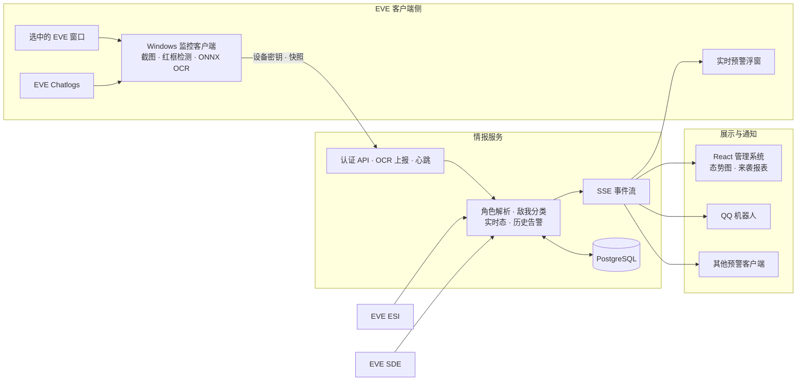
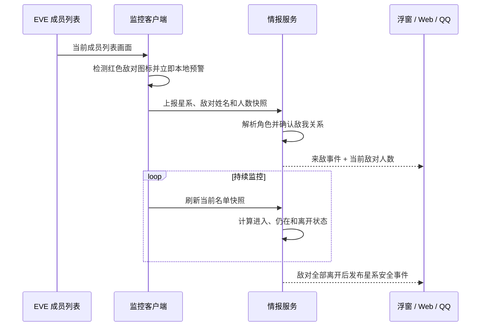
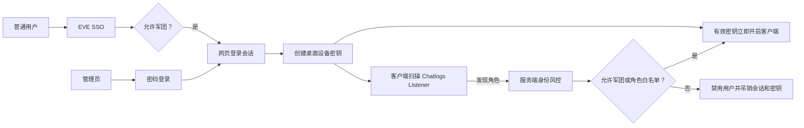

# EVE Sentry

EVE Sentry 是一套面向 EVE Online 本地频道的敌对监控与预警系统，包含 Windows
监控客户端、Python 情报服务、React 管理页面和 QQ 机器人事件接入。

## 系统架构



## 预警链路



## 身份与访问



## 当前能力

- 监控客户端只采集用户选中的 EVE 窗口，识别成员列表中的红色敌对图标与角色名。
- 客户端使用 ONNX Runtime + DirectML 运行 PP-OCRv6 检测和识别模型。
- 当前星系从所选角色的 EVE 本地聊天日志读取，不需要周期查询 ESI 位置接口。
- OCR 快照和客户端心跳写入服务端，服务端负责角色解析、敌我分类、实时态和历史告警。
- 客户端可同时开启预警浮窗，通过 SSE 接收所有在线节点和敌对人数变化。
- Web 管理系统提供态势图、来袭报表、设备密钥、用户、身份规则和审计日志。
- 管理员使用密码登录，普通用户使用 EVE SSO；桌面客户端使用设备密钥。

## 本地启动

Python 3.11+：

```powershell
python -m venv .venv
.\.venv\Scripts\python -m pip install -r requirements-onnx.txt
$env:EVE_SENTRY_OCR_BACKEND = "onnx"
$env:EVE_SENTRY_OCR_DEVICE = "dml"
python -m app.detector_client
```

## 客户端下载与更新

Windows 便携客户端通过 GitHub Release 发布，安装包包含 ONNX Runtime、DirectML 和
PP-OCRv6 模型。客户端启动时静默检查版本，也可在左侧版本区手动下载；安装前会校验
文件大小和 SHA256，随后退出、替换目录并自动重启。大文件下载由 Cloudflare Worker
代理并缓存，发布与部署方式见 [监控客户端](docs/client.md)。

ONNX 模型应位于：

```text
.runtime/onnx-models/PP-OCRv6_medium_det/model.onnx
.runtime/onnx-models/PP-OCRv6_medium_rec/model.onnx
```

本地服务端可使用 SQLite：

```powershell
python -m pip install -r requirements-server.txt
python -m app.server --host 127.0.0.1 --port 8765
```

前端开发：

```powershell
cd frontend
npm ci
npm run dev
```

## 测试

```powershell
pytest
cd frontend
npm test
npm run build
```

## 文档

- [系统架构](docs/architecture.md)
- [监控客户端](docs/client.md)
- [认证与 EVE 身份校验](docs/authentication.md)
- [Web 管理系统](docs/web-console.md)
- [API 参考](docs/api-reference.md)
- [服务端部署](docs/server-deployment.md)

运行时数据库、配置、EVE SSO token、本地密钥状态和模型缓存均不应提交到仓库。
