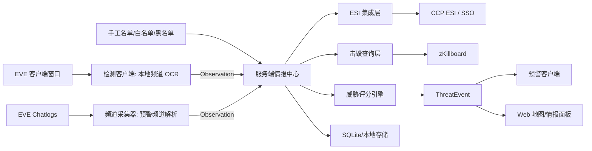

# EVE Sentry 情报平台架构

> 日期: 2026-06-30  
> 状态: 规划基线  
> 目标: 将 EVE Sentry 从单机 OCR 预警器升级为多源威胁情报平台。

## 1. 架构目标

EVE Sentry 后续不再只依赖本地频道 OCR。系统应同时接入本地频道、预警频道、ESI、击毁记录、手工名单等多种来源，并在服务端统一融合判断。

核心原则:

- 检测端只负责采集和上报，不负责最终威胁判断。
- 预警端只负责接收和通知，不直接依赖 OCR 或 ESI。
- 服务端是唯一情报中心，负责身份解析、缓存、评分、去重、冷却和事件生成。
- 所有情报最终落到稳定 ID 上，例如 `character_id`、`corporation_id`、`alliance_id`、`solar_system_id`。
- 所有告警必须带证据链，能解释为什么报警。

## 2. 总体视图



## 3. 运行组件

### 3.1 检测客户端

职责:

- 查找 EVE 窗口。
- 截取本地频道成员列表。
- OCR 识别角色名。
- 上报 `Observation`。

不负责:

- 不做最终报警判断。
- 不直接查 ESI 或 zKillboard。
- 不维护全局白名单/黑名单。

当前入口建议:

```powershell
uv run python -m app.detector_client
```

检测客户端默认只上报到服务端，不弹出本地预警窗口。只有显式设置
`EVE_SENTRY_SHOW_POPUPS=1` 时才保留旧的本地弹窗行为；正式联调建议由
独立预警客户端消费服务端 alert。

### 3.2 频道采集器

职责:

- 监听 EVE chatlogs 目录。
- 解析联盟预警频道、军团频道、自定义情报频道。
- 从文本中提取星系、角色名、跳数、方向、原始消息。
- 上报 `Observation`，并保留原始文本作为证据。

默认日志目录:

```text
%USERPROFILE%\Documents\EVE\logs\Chatlogs
```

当前入口建议:

```powershell
# 只解析并打印，不连接服务端，适合先用样例 chatlog 验证规则
uv run python -m app.channel_client --log-dir .\samples\Chatlogs --once --include-existing --dry-run --json

# 启动临时本地服务端，验证样例 chatlog 能生成 observation 和 alert
uv run python scripts/channel_smoke.py --json

# 长驻采集并上报到本地服务端
uv run python -m app.channel_client --server http://127.0.0.1:8765 --channel "Alliance Intel" --server-parse
```

实现注意:

- EVE 日志文件可能是 UTF-16 或 UTF-8，需要自动探测。
- 采集器需要记录每个文件的读取偏移，重启后避免重复处理历史行。
- 同一个频道可能每天生成新文件，需要按文件名和修改时间发现新日志。
- 原始行不要丢，解析失败也可以作为低置信度情报保存。

### 3.3 服务端情报中心

职责:

- 接收所有来源的 `Observation`。
- 调用 ESI 做名字解析和身份补全。
- 调用击毁查询层补充近期行为画像。
- 执行白名单、黑名单、关系、击毁活跃度、频道提及、冷却去重等规则。
- 生成 `ThreatEvent`。
- 提供 REST API 给检测端、频道采集器、预警端和 Web 面板。

当前入口建议:

```powershell
uv run python -m app.server --host 127.0.0.1 --port 8765
```

服务端默认使用 SQLite，数据文件为 `intel.sqlite3`；如需沿用旧 JSON
联调数据，可显式指定 `--storage json --data intel_reports.json`。

### 3.4 预警客户端

职责:

- 轮询或订阅服务端的 `ThreatEvent`。
- 播放声音、显示托盘通知或弹窗。
- 展示最近预警列表和证据链。

不负责:

- 不截图。
- 不 OCR。
- 不解析频道日志。
- 不直接查询外部 API。

当前入口建议:

```powershell
uv run python -m app.alert_client --server http://127.0.0.1:8765
```

常用模式:

```powershell
# 长驻订阅，并弹出本地预警窗口
uv run python -m app.alert_client --server http://127.0.0.1:8765 --popup

# 输出/弹窗后回写已确认状态
uv run python -m app.alert_client --server http://127.0.0.1:8765 --ack --ack-by alert-client

# 一次性检查当前服务端 alert，适合联调或脚本验证
uv run python -m app.alert_client --server http://127.0.0.1:8765 --once --include-existing --json --poll --details --unacknowledged-only --min-level high

# 使用独立状态文件续接已处理 alert；需要重放时可加 --no-state 或删除状态文件
uv run python -m app.alert_client --server http://127.0.0.1:8765 --details --state alert_client_state.json
```

## 4. 核心数据模型

### 4.1 Observation

`Observation` 是所有采集源的统一输入模型。

```json
{
  "id": "obs_...",
  "source": "local_ocr",
  "source_instance": "detector-pc-1",
  "system_name": "Tama",
  "system_id": 30002813,
  "names": ["Some Pilot"],
  "character_ids": [123456789],
  "confidence": 0.82,
  "raw_text": "",
  "metadata": {
    "hostile_count": 3,
    "sender": "Scout A",
    "channel": "Alliance Intel",
    "jump_count": 2,
    "direction": "Oijanen"
  },
  "seen_at": "2026-06-30T12:00:00Z",
  "received_at": "2026-06-30T12:00:02Z"
}
```

来源类型:

- `local_ocr`: 本地频道 OCR。
- `intel_channel`: 预警频道日志。
- `manual`: 用户手工录入。
- `killboard`: 击毁记录导入或周期查询。
- `esi`: ESI 补全产生的派生证据。

### 4.2 CharacterProfile

角色身份画像。

```json
{
  "character_id": 123456789,
  "name": "Some Pilot",
  "corporation_id": 987654,
  "corporation_name": "Some Corp",
  "alliance_id": 555555,
  "alliance_name": "Some Alliance",
  "security_status": -4.8,
  "resolved_at": "2026-06-30T12:00:03Z"
}
```

### 4.3 KillActivity

击毁行为画像。

```json
{
  "character_id": 123456789,
  "window": "24h",
  "kills": 6,
  "losses": 1,
  "systems": ["Tama", "Oijanen"],
  "ship_groups": ["Interceptor", "Stealth Bomber"],
  "latest_kill_at": "2026-06-30T11:42:00Z",
  "source": "zkillboard"
}
```

### 4.4 ThreatEvent

最终预警事件。

```json
{
  "id": "evt_...",
  "level": "high",
  "score": 82,
  "system_name": "Tama",
  "system_id": 30002813,
  "character_id": 123456789,
  "name": "Some Pilot",
  "evidence": [
    {
      "type": "local_ocr_seen",
      "weight": 40,
      "summary": "本地频道 OCR 看到 Some Pilot"
    },
    {
      "type": "intel_channel_report",
      "weight": 25,
      "summary": "8 分钟前预警频道提到 Tama 有红"
    },
    {
      "type": "recent_kill_activity",
      "weight": 15,
      "summary": "24 小时内在相邻区域有击毁"
    }
  ],
  "created_at": "2026-06-30T12:00:04Z"
}
```

### 4.5 AlertDetail

`GET /api/alerts/{id}` 返回单条预警的完整解释包，供独立预警客户端和 Web 面板展示。

```json
{
  "alert": {"id": "evt_...", "level": "high", "score": 85},
  "observation": {"id": "obs_...", "source": "local_ocr"},
  "context": {
    "channel_mentions": [],
    "character_profiles": [],
    "kill_activities": [],
    "group_activities": []
  },
  "explanation": {
    "summary": "HIGH alert for Some Pilot in Tama (score 85)",
    "reasons": ["Local OCR saw Some Pilot in Tama"],
    "context": ["Recent channel same-system mention in Tama 2m ago"],
    "sources": ["local_ocr", "scoring", "enrichment"]
  }
}
```

`context` 保留结构化原始情报，`explanation` 是服务端生成的可显示摘要。预警客户端优先展示 `explanation.context`，没有该字段时回退到本地格式化 `context`。

## 5. ESI 集成

ESI 是身份和宇宙数据的权威补全源。

第一阶段只接公开接口:

- 名字解析: 角色名、军团名、联盟名、星系名转 ID。
- ID 反查: ID 转可读名称。
- 角色公开资料: 角色所属军团、联盟、安全状态等。
- 星系资料: 星系、星座、区域、安全等级。

第二阶段接 SSO:

- OAuth2 + PKCE 登录。
- 保存 refresh token，并加密或本机安全存储。
- 读取当前角色位置，减少手工填写当前星系。
- 读取联系人或 standings，用于关系判断。

设计要求:

- ESI 客户端必须尊重缓存头和错误限制。
- 所有 ESI 结果要本地缓存。
- 服务端保存用户身份时不能只依赖 `character_id`，还要记录 `CharacterOwnerHash`，避免角色转让后身份串号。
- 只申请需要的 scopes，后续按功能逐步增加。

当前服务端公开数据补全通过启动参数启用:

```bash
python -m app.server --enable-esi --esi-cache esi_cache.json
```

启用后，服务端会在保存 observation 时尽力补全 `system_id` 和
`character_ids`，并在生成 alert 时把角色公开资料作为评分证据。角色公开
资料会尽力补齐 `corporation_name` 和 `alliance_name`，相关查询结果写入本地
ESI 缓存；ESI 查询失败时保留原 observation，不阻塞上报链路。

官方参考:

- ESI overview: https://developers.eveonline.com/docs/services/esi/overview/
- EVE SSO: https://developers.eveonline.com/docs/services/sso/
- ESI rate limiting: https://developers.eveonline.com/docs/services/esi/rate-limiting/

## 6. 击毁查询

击毁查询用于补充行为画像，不作为唯一报警来源。

推荐来源:

- zKillboard: 查询近期 kills/losses，适合行为画像和活动区域判断。
- ESI killmail endpoint: 当已有 killmail id/hash 时获取权威 killmail 详情。

第一阶段能力:

- 按角色查询最近击毁和损失。
- 按军团/联盟查询近期活跃。
- 按星系/区域查询近期击毁热度。
- 提取常用舰种、常见活动区域、最新击毁时间。

缓存策略:

- 同一角色的近期击毁查询至少缓存 10 分钟。
- 同一军团/联盟的聚合查询至少缓存 30 分钟。
- 星系热度至少缓存 5 分钟。
- 请求必须设置明确 `User-Agent`。
- 对 420/429/5xx 做退避，不在扫描循环里阻塞。

当前服务端击毁画像通过启动参数启用:

```bash
python -m app.server --enable-killboard --zkill-cache zkill_cache.json
```

启用后，服务端会按 observation 内的 `character_ids` 查询近期 zKillboard 活动，生成 `recent_kill_activity` evidence，并把它纳入 `ThreatEvent` 分数。查询失败时优先使用本地过期缓存继续生成画像；无缓存或无角色 ID 时退回基础评分。
HTTP API 也支持按角色、星系、军团、联盟查询近期击毁画像。

官方或一手参考:

- zKillboard API wiki: https://github.com/zKillboard/zKillboard/wiki/API-%28Killmails%29
- ESI killmails: https://developers.eveonline.com/docs/services/esi/endpoints/

## 7. 预警频道解析

频道解析是低成本高收益的第二情报源。

输入示例:

```text
[ 2026.06.30 12:01:12 ] Scout A > Tama +3 reds
[ 2026.06.30 12:02:44 ] Scout B > Oijanen 发现 Some Pilot
[ 2026.06.30 12:03:10 ] Scout C > ABC-123 有红，往 D-Scan 方向
```

解析目标:

- 时间。
- 发送人。
- 星系。
- 角色名。
- 数量。
- 方向或跳数。
- 原文。
- 置信度。

解析结果:

```json
{
  "source": "intel_channel",
  "channel": "Alliance Intel",
  "sender": "Scout A",
  "system_name": "Tama",
  "names": [],
  "hostile_count": 3,
  "raw_text": "Tama +3 reds",
  "confidence": 0.7,
  "metadata": {
    "hostile_count": 3,
    "sender": "Scout A",
    "channel": "Alliance Intel",
    "jump_count": null,
    "direction": ""
  },
  "seen_at": "2026-06-30T12:01:12Z"
}
```

实现策略:

- 先做规则解析，后续再考虑更复杂的 NLP。
- 星系识别优先使用 ESI/SDE 星系词典。
- 人名识别不要过度猜测，宁可保留原文，交给人工或后续 ESI resolver。
- 服务端按 `source`、频道/`source_instance`、`seen_at` 和 `raw_text`
  对相同频道行做幂等去重，避免采集器重启或重复上报生成重复 alert。

## 8. 威胁评分

评分引擎输出 `ThreatEvent`。

建议初始规则:

| 证据 | 分值 |
| --- | ---: |
| 本地 OCR 看到非白名单角色 | +40 |
| 命中黑名单角色 | +80 |
| 命中敌对军团/联盟 | +60 |
| 10 分钟内同星系预警频道提及 | +30 |
| 30 分钟内相邻星系预警频道提及 | +15 |
| 24 小时内角色在本区域有击毁 | +20 |
| 7 天内角色高频击毁 | +10 |
| 军团/联盟近期有击毁活跃 | +5 / +15 |
| 常用舰种偏 PvP | +10 |
| 命中白名单 | -100 |
| 最近已报警且仍在冷却 | 抑制事件 |

等级建议:

- `low`: 20 到 39。
- `medium`: 40 到 69。
- `high`: 70 到 99。
- `critical`: 100 以上。

告警必须包含 evidence，不允许只返回一个分数。
服务端会按 `seen_at` 把近期 `intel_channel` observation 作为上下文 evidence：
同星系生成 `intel_channel_same_system_recent`，相邻星系生成
`intel_channel_adjacent_system_recent`；预警频道 observation 本身不再引用自身作为上下文。

## 9. API 草案

为了兼容现有实现，保留当前 `/api/intel`，新增更语义化的接口。

```text
POST /api/observations
GET  /api/observations?source=&system=&name=&limit=
POST /api/channel-lines

GET  /api/alerts?since=&limit=&acknowledged=&min_score=&min_level=
GET  /api/alerts/{id}
POST /api/alerts/{id}/ack

GET  /api/characters/{character_id}
GET  /api/characters/by-name/{name}

GET  /api/systems/by-name/{name}

GET  /api/kill-activity/character/{character_id}
GET  /api/kill-activity/system/{system_id}
GET  /api/kill-activity/corporation/{corporation_id}
GET  /api/kill-activity/alliance/{alliance_id}

GET  /api/map/snapshot
```

当前服务端已实现:

- `POST /api/alerts/{id}/ack`: 标记单个 alert 已确认，并在 JSON 和 SQLite
  存储中保留 `acknowledged`、`acknowledged_at`、`acknowledged_by` 和
  `acknowledgement_note`。
- `GET /api/alerts`: 支持 `acknowledged=true|false`、`min_score` 和
  `min_level=low|medium|high|critical` 过滤；事件流 `/api/events` 使用同一套
  alert 过滤参数。
- `GET /api/alerts/{id}`: 返回单个 alert 的解释详情，包括源 observation、
  频道上下文、角色公开资料和击毁画像上下文。
- `GET /api/characters/{character_id}`: 需要启用 ESI，返回角色公开资料。
- `GET /api/characters/by-name/{name}`: 需要启用 ESI，先解析名字再返回角色公开资料。
- `GET /api/systems/by-name/{name}`: 需要启用 ESI，返回星系公开资料。
- `GET /api/kill-activity/character/{character_id}`: 需要启用 killboard，返回角色近期击毁画像。
- `GET /api/kill-activity/system/{system_id}`: 需要启用 killboard，返回星系近期击毁热度。
- `GET /api/kill-activity/corporation/{corporation_id}`: 需要启用 killboard，返回军团近期击毁/损失画像。
- `GET /api/kill-activity/alliance/{alliance_id}`: 需要启用 killboard，返回联盟近期击毁/损失画像。

实时推送分两步:

1. MVP 继续使用轮询。
2. 稳定后增加 SSE 或 WebSocket。

## 10. 存储规划

服务端默认使用 SQLite 存储，旧 JSON 文件仍保留为兼容导入来源。

建议表:

- `observations`
- `characters`
- `corporations`
- `alliances`
- `systems`
- `kill_activity`
- `threat_events`
- `evidence`
- `watchlist_entries`
- `api_cache`
- `client_heartbeats`

迁移策略:

- 新服务端默认写 SQLite。
- `--storage json --data intel_reports.json` 可继续用于旧联调数据。
- SQLite 启动时可把 `intel_reports.json` 导入数据库，导入标记保存在
  `store_meta` 中，避免重复导入。
- 也可以显式执行一次性导入:

```powershell
uv run python scripts/import_intel_json.py --source intel_reports.json --db intel.sqlite3 --json
```

## 11. 模块规划

```text
app/
  core/
    models.py
    time.py
  detector/
    client.py
    publisher.py
  channels/
    log_watcher.py
    parser.py
    patterns.py
  esi/
    client.py
    sso.py
    resolver.py
    cache.py
  killboard/
    zkill_client.py
    analyzer.py
  intel/
    observations.py
    scoring.py
    evidence.py
  server/
    api.py
    store.py
    rules.py
    events.py
    web.py
  alerter/
    client.py
    notifier.py
```

现有文件可以逐步迁移，不需要一次性大重构。
