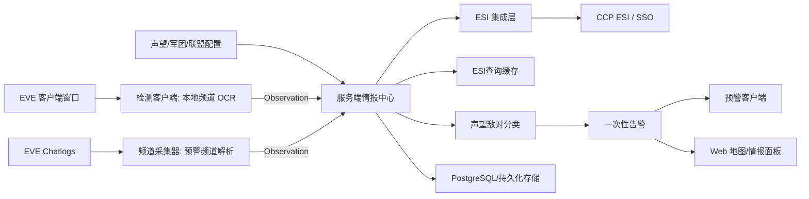

# EVE Sentry 情报平台架构

> Current status (2026-07-09): zKillboard/killboard enrichment has been removed
> from the first production path because the JSON cache caused sustained server
> memory growth. The server now relies on OCR snapshots, intel channel lines,
> ESI identity/profile data, standings, and configured friendly/hostile filters.
> Any older killboard sections below are historical design notes and must not be
> treated as an enabled runtime dependency.

> Current workflow baseline (2026-07-10): 第一版不再使用威胁评分系统。服务端只做
> ESI 查询缓存、声望驱动的敌对分类和一次性告警。ESI 查询条件是“角色从未查询过
> ESI”，不是“本次名单新增”。后续架构设计以 `docs/intel-workflows.md` 为准。

> 日期: 2026-07-01
> 状态: 当前实现基线
> 目标: 将 EVE Sentry 从单机 OCR 预警器升级为多源威胁情报平台。

## 当前实现状态

这份文档描述目标架构和当前实现的交集。详细待做清单见
`docs/intel-platform-roadmap.md`。

| 模块 | 当前状态 | 主要待做 |
| --- | --- | --- |
| 监控客户端 | 已能绑定指定 EVE 窗口、后台截图、红图标检测、ONNX DirectML OCR、snapshot/heartbeat 上报，并以内置开关控制 SSE 浮窗预警 | 补区域选择排障细节和实机多开验收 |
| 预警浮窗 | 已集成到监控客户端，消费 `/api/v1/events` 的 alert/safe 事件；关闭预警不影响 OCR 上报 | 补更多运行诊断 |
| 服务端模型/API | 已有 `Observation`、`ThreatEvent`、alert detail、实体情报查询、ack、配置 API、health、heartbeats、SQLite | 补更细客户端诊断 |
| 预警频道解析 | 已有 chatlog watcher、parser、`POST /api/v1/channel-lines`、解析诊断和 ESI 辅助修正 | 扩更多真实频道格式 |
| ESI | 已有公开解析、缓存状态、SSO、session、当前位置、contacts/standings | 补 token 迁移策略和更细失败类型 |
| 击毁画像 | 已从第一版移除，不参与当前告警链路 | 后续如恢复，必须先设计有界缓存和内存上限 |
| 分类告警 | 第一版目标改为声望驱动的敌对分类和一次性告警，不再使用威胁评分 | 用 `ClassificationEngine` 替代旧评分路径 |
| 推送/存储 | 默认 SQLite，SSE 支持过滤、续接、keepalive、并发；runtime data、heartbeat 状态页和 SQLite heartbeat 持久化已接通 | 补更细状态字段 |

## 1. 架构目标

EVE Sentry 后续不再只依赖本地频道 OCR。系统应同时接入本地 OCR、预警频道、ESI、手工名单等多种来源，并在服务端统一分类判断。

核心原则:

- 检测端只负责采集和上报，不负责最终威胁判断。
- 预警端只负责接收和通知，不直接依赖 OCR 或 ESI。
- 服务端是唯一情报中心，负责身份解析、ESI 查询缓存、声望分类、告警去重和事件生成。
- OCR 名单只表示“当前本地可见”；红色声望图标是客户端提交的明确敌对证据。
  服务端仍负责显式白名单抑制、状态持久化和最终告警事件生成。
- 所有情报最终落到稳定 ID 上，例如 `character_id`、`corporation_id`、`alliance_id`、`solar_system_id`。
- 所有告警必须带分类原因，能解释为什么报警。

## 2. 总体视图



## 3. 运行组件

### 3.1 检测客户端

职责:

- 查找 EVE 窗口。
- 只绑定并监控下拉列表中选中的 EVE 窗口。
- 从选中角色的本地 Chatlogs 获取当前星系。
- 截取本地频道成员列表，先检测红色声望图标，再用 OCR 识别角色名。
- 通过 `/api/v1/ocr/snapshot` 上报当前扫描到的角色名列表、星系、窗口和时间上下文。
- 红图标与 OCR 行可靠对应时只上报敌对行，否则回退上报完整名单。
- 可选启动内置 SSE 预警；本机红图标人数变化会立即更新右上角浮窗，上报服务端后也会通过 SSE 同步给其他预警节点。

不负责:

- 不做 ESI 或公开资料分类；检测到红色声望图标时直接作为明确敌对证据触发本地预警。
- 不判断敌对或友好声望。
- 不直接查 ESI 或 zKillboard。
- 不维护本地名单过滤。

当前入口建议:

```powershell
$env:EVE_SENTRY_OCR_BACKEND = "onnx"
$env:EVE_SENTRY_ONNX_MODEL_DIR = "$PWD\.runtime\onnx-models"
.\scripts\start_monitor_client.ps1 `
  -Server http://127.0.0.1:8765 `
  -OcrDevice dml
```

`开始监控` 只控制截图和 OCR 上报；`开启预警` 单独控制 SSE、右上角浮窗和声音，
不发送 Windows 右下角系统通知。关闭预警不会停止 OCR 上报。源码运行必须显式设置
`EVE_SENTRY_OCR_BACKEND=onnx`，否则兼容默认值会启动 PaddleOCR；轻量 ONNX 发行包通过
runtime hook 自动选择 ONNX。
PowerShell 启动脚本会把 `-Server` 映射为 `EVE_SENTRY_INTEL_URL`，并可用
`-ChatlogDir`、`-System`、`-NoPublish` 等参数配置本地运行。

OCR 上报语义:

- 每次扫描只提交当前可见名单，不提交“新增威胁”或“已过滤威胁”。
- `hostile_icon_count` 表示客户端在当前帧检测到的红色声望图标数量。
- 人名中 `I` / `l` 等易混字符由服务端结合 ESI 解析和缓存做规范化。
- 客户端日志中的“无威胁”只表示本地没有生成弹窗或告警，不代表已经完成敌对判断。
- 同一窗口、同一星系、同一角色的刷新、离开和过期都由服务端 `active_intel` 维护。

检测客户端启动后会定期向 `/api/v1/clients/heartbeats` 上报 `detector_client` 状态，
并在开始/停止监控时立即刷新一次状态。心跳 `details` 当前包含是否正在监控、
当前星系、星系来源、是否启用本地弹窗和当前窗口标题；多窗口监控时还会带
`target_count` 和 `targets[]`，每个 target 包含窗口 `client_id`、`window_title`、
`region` 和 monitoring 状态；可用
`EVE_SENTRY_HEARTBEAT_INTERVAL=15` 调整上报间隔。

多窗口行为:

- 启动监控时会枚举当前 EVE 窗口，并为每个窗口启动独立 worker。
- 每个窗口使用独立 `client_id` 上报 OCR snapshot，避免 active intel 互相过期。
- 成员列表区域按窗口保存；未保存过的窗口使用默认右侧成员列表区域。
- 当前 ESI 位置仍是全局上下文，不区分多个角色处于不同星系的情况。

无真实 EVE 窗口时，用 `uv run python scripts/monitor_ui_smoke.py --json --fake-window-count 2`
验证检测客户端 UI 能展示多个窗口 selector，且不会触发真实截图、OCR 或网络请求。
真实多开验收必须看服务端只读检查结果里的 `details.target_count` 和
`details.targets[]`，例如 `uv run python scripts/integration_status_check.py --expect-detector --expect-monitoring --min-targets 2`。
当真实 OCR 已经识别并上报成员名单时，再加
`--min-active-ocr-targets 2`，用服务端 active OCR rows 的不同 `client_id` /
`source_instance` 证明多个窗口都实际产生了实时名单。

当前星系来源:

- 设置 `EVE_SENTRY_SYSTEM=Tama` 时，检测客户端使用该手工星系名上报。
- 未设置 `EVE_SENTRY_SYSTEM` 时，检测客户端只读取本地 EVE Chatlogs 获取
  当前星系，不请求服务端 ESI session。默认每 5 秒检查一次，可用
  `EVE_SENTRY_LOCAL_SYSTEM_TTL=5` 调整，最小 1 秒。

### 3.2 独立频道日志客户端

职责:

- `app.channel_client` 独立监听 EVE chatlogs 目录。
- 解析联盟预警频道、军团频道、自定义情报频道。
- 从文本中提取星系、角色名、跳数、方向、原始消息。
- 上报 `Observation`，并保留原始文本作为证据。

默认日志目录:

```text
%USERPROFILE%\Documents\EVE\logs\Chatlogs
```

频道采集与 OCR 监控客户端分离，`app.channel_client` 可作为长驻采集、调试或批处理入口:

```powershell
# 只解析并打印，不连接服务端，适合先用样例 chatlog 验证规则
uv run python -m app.channel_client --log-dir .\samples\Chatlogs --once --include-existing --dry-run --json

# 启动临时本地服务端，验证样例 chatlog 能生成 observation 和 alert
uv run python scripts/channel_smoke.py --json

# 长驻采集并上报到本地服务端
uv run python -m app.channel_client --server http://127.0.0.1:8765 --channel "Alliance Intel"
```

独立频道 CLI 只把原始日志行提交到 `/api/v1/channel-lines`，由服务端解析和入库。

实现注意:

- EVE 日志文件可能是 UTF-16 或 UTF-8，需要自动探测。
- 采集器需要记录每个文件的读取偏移，重启后避免重复处理历史行。
- 频道过滤默认按完整频道名精确匹配；需要宽松匹配时必须显式使用 `*` 或 `?` 通配符。
- 同一个频道可能每天生成新文件，需要按文件名和修改时间发现新日志。
- 原始行不要丢，解析失败也可以作为低置信度情报保存。

### 3.3 服务端情报中心

职责:

- 接收所有来源的 `Observation`。
- 对 OCR 名单和频道文本检查 ESI 查询缓存；只对从未查询过 ESI 的角色发起 ESI 查询。
- 缓存角色 ID、军团、联盟、standing，以及 `not_found` / `failed` / `retry_after` 状态。
- 执行声望、友好/敌对军团联盟和 standing 分类规则。
- 角色被分类为敌对时生成一次性 `ThreatEvent`。
- 提供 REST API 给检测端、频道采集器、预警端和 Web 面板。

OCR 告警门槛:

- `local_ocr` / `ocr` / `eve-sentry-detector` observation 默认只刷新实时可见名单。
- 优秀声望、良好声望归为友好，不进入敌对实时观察和告警。
- 中立声望、不良声望、糟糕声望归为敌对，服务端分类为敌对并生成一次性告警。
- 未查询到声望、ESI 查询失败或无配置命中时，OCR observation 只记录观察，不生成 `ThreatEvent`。
- 预警频道上下文只作为观察来源和解释上下文，不能单独把一个 OCR 可见角色判定为敌对。

当前入口建议:

```powershell
uv run python -m app.server --host 127.0.0.1 --port 8765
```

服务端默认使用 SQLite，数据文件为 `intel.sqlite3`；如需沿用旧 JSON
联调数据，可显式指定 `--storage json --data intel_reports.json`。

当前 Web 面板提供星图、手工情报录入、分类配置、服务端 alert detail 展示、
实体情报摘要、客户端 heartbeat 状态，以及 ESI session 状态/当前位置展示；
`Client Status` 区块会显示检测端、预警端和频道采集器最近一次 heartbeat，
当前位置可一键填入手工情报表单。

### 3.4 预警客户端

职责:

- 订阅服务端 `/api/v1/events` SSE 中的 `alert` 事件。
- 常驻托盘后台，并显示桌面半透明浮窗。
- 播放声音；浮窗按在线监控节点所在星系显示固定方框，红色表示有敌对、绿色表示安全，并实时显示敌对人数。
- 使用本地 state 去重，避免重启或重连后重复响。

不负责:

- 不截图。
- 不 OCR。
- 不解析频道日志。
- 不直接查询外部 API。
- 不做评分、声望、ESI 或敌友判断。
- 不调用 `POST /api/v1/alerts/{id}/ack`。

当前入口建议:

```powershell
.\scripts\start_alert_client.ps1 -Server http://127.0.0.1:8765
```

默认模式只订阅 `/api/v1/events` SSE 事件流；事件流断开时自动重连，不回退到
`/api/v1/alerts` 轮询。服务端会同时推送 `bootstrap` 和 `alert`，预警客户端只消费
`event: alert`，并忽略 `bootstrap`、keepalive 和未知事件。
PowerShell 启动脚本底层仍是 `python -m app.alert_client`。

常用模式:

```powershell
# 长驻托盘 + 桌面半透明浮窗
.\scripts\start_alert_client.ps1 -Server http://127.0.0.1:8765

# 使用独立状态文件记录本地已接收 alert
.\scripts\start_alert_client.ps1 -Server http://127.0.0.1:8765 -State alert_client_state.json

# 后台启动，stdout/stderr 写入本地日志目录
.\scripts\start_alert_client.ps1 -Server http://127.0.0.1:8765 -Background -LogDir "$env:LOCALAPPDATA\EVE Sentry\logs"
```

预警客户端只接收服务端告警，不 ack、不清理服务端告警状态；Web 工作台和预警客户端可以同时消费同一条 SSE。

## 4. 核心数据模型

### 4.1 Observation

`Observation` 是所有采集源的统一输入模型。

```json
{
  "id": "obs_...",
  "source": "local_ocr",
  "source_instance": "detector-pc-1",
  "system_name": "Tama",
  "system_id": 30002813,
  "names": ["Some Pilot"],
  "character_ids": [123456789],
  "confidence": 0.82,
  "raw_text": "",
  "metadata": {
    "hostile_count": 3,
    "sender": "Scout A",
    "channel": "Alliance Intel",
    "jump_count": 2,
    "direction": "Oijanen"
  },
  "seen_at": "2026-06-30T12:00:00Z",
  "received_at": "2026-06-30T12:00:02Z"
}
```

来源类型:

- `local_ocr`: 本地频道 OCR。
- `intel_channel`: 预警频道日志。
- `manual`: 用户手工录入。
- `esi`: ESI 补全产生的身份和分类依据。

### 4.2 Active Intel State

`Observation` 保留为历史审计日志：它记录情报曾经被看到过、来自哪里、原文和
解析结果是什么，不会因为目标离开本地或频道被 clear 而删除。实时面板使用
`active_intel`，这是从历史 observation 派生出的当前态，可以刷新、过期或被清除。

OCR 上传走 `/api/v1/ocr/snapshot`，客户端只提交当前扫描检测到的 `names` 列表
和最小上下文，例如 `client_id`、`source_instance`、`system_name`、`system_id`
与 `seen_at`。服务端按客户端、窗口、星系和角色名 diff 这份快照：仍可见的行刷新
`last_seen_at` 并递增 `seen_count`，新出现的角色创建 active 行和对应历史 observation，
缺失超过 grace period 的角色标记为 inactive 并写入 `left_at`。默认实时列表只返回
active 行，历史 observations 继续可查。

active OCR 行代表“当前可见名单”，不等同于告警。Web 星图可以用它显示本地可见人数，
但预警客户端只消费服务端生成的 `ThreatEvent`。如果某个 OCR 名字经 ESI 查询缓存后
仍未分类为敌对，它可以保留为历史 observation 或 active row，但不会出现在
alert 列表。

预警频道同样保留 observation 作为审计记录，但 active state 由频道语义维护。普通
频道报告按 metadata 计算 TTL，并写入带 `expires_at` 的 `active_intel` 行；包含
clear 信号的同频道、同星系消息会将匹配实时态标记为 inactive 并写入 `cleared_at`，
不会删除原始 observation。

### 4.3 CharacterProfile

角色身份画像。

```json
{
  "character_id": 123456789,
  "name": "Some Pilot",
  "corporation_id": 987654,
  "corporation_name": "Some Corp",
  "alliance_id": 555555,
  "alliance_name": "Some Alliance",
  "security_status": -4.8,
  "resolved_at": "2026-06-30T12:00:03Z"
}
```

### 4.4 EsiLookupState

ESI 查询缓存状态。服务端只对从未查询过 ESI 的角色发起查询，并缓存失败状态，避免
每次 OCR 或频道上报都重复查询。

```json
{
  "name": "Some Pilot",
  "character_id": 123456789,
  "status": "resolved",
  "corporation_id": 987654,
  "alliance_id": 555555,
  "classification": "red",
  "reason": "hostile_alliance",
  "queried_at": "2026-06-30T12:00:03Z",
  "retry_after": null
}
```

### 4.5 ThreatEvent

最终预警事件。

```json
{
  "id": "evt_...",
  "classification": "red",
  "reason": "hostile_alliance",
  "system_name": "Tama",
  "system_id": 30002813,
  "character_id": 123456789,
  "name": "Some Pilot",
  "sources": ["local_ocr", "esi"],
  "alert_key": "123456789:red",
  "created_at": "2026-06-30T12:00:04Z"
}
```

### 4.6 AlertDetail

`GET /api/v1/alerts/{id}` 返回单条预警的完整解释包，供内置预警浮窗和 Web 面板展示。

```json
{
  "alert": {"id": "evt_...", "classification": "red", "reason": "hostile_alliance"},
  "observation": {"id": "obs_...", "source": "local_ocr"},
  "context": {
    "channel_mentions": [],
    "character_profiles": [],
    "esi_lookup": {"status": "resolved"}
  },
  "explanation": {
    "summary": "RED alert for Some Pilot in Tama",
    "reasons": ["Some Pilot matched hostile alliance 555555"],
    "context": [
      "Local OCR saw Some Pilot in Tama",
      "ESI profile resolved Some Pilot to alliance 555555"
    ],
    "sources": ["local_ocr", "esi", "classification"]
  }
}
```

`context` 保留结构化原始情报，`explanation` 是服务端生成的可显示摘要。
预警客户端和 Web 面板都优先展示服务端 `explanation`；Web 面板还会根据
`entities` 中的角色、星系、军团、联盟 ID 调用 `/api/intel/...` 获取关联
observation、alert 和 activity 摘要。

## 5. ESI 集成

ESI 是身份和宇宙数据的权威补全源。

第一阶段只接公开接口:

- 名字解析: 角色名、军团名、联盟名、星系名转 ID。
- ID 反查: ID 转可读名称。
- 角色公开资料: 角色所属军团、联盟、安全状态等。
- 星系资料: 星系、星座、区域、安全等级。

第二阶段接 SSO:

- OAuth2 + PKCE 登录。
- 保存 refresh token，并加密或本机安全存储。
- 读取当前角色位置，减少手工填写当前星系。
- 读取联系人或 standings，用于关系判断。

当前本地会话层:

- `app.esi.sso` 负责 PKCE 登录、callback、token 保存和 refresh。
- `app.esi.session` 负责从 `esi_tokens.json` 读取 token，过期时刷新，并使用
  authenticated ESI 获取当前位置和 contacts/standings。
- token storage 支持 `auto`、`secure` 和 `plain`；`auto` 在 Windows 上使用当前
  用户 DPAPI 保护 token 文件，其他平台回退到普通 JSON，`secure` 在无可用保护器
  时会直接失败。
- contacts 可转换成 `contact_standing` 注入角色 profile，供分类规则生成
  `hostile_standing` 或 `friendly_standing` reason。
- 当 OCR 长角色名被 EVE 成员列表截断、公开 `/universe/ids/` 精确解析返回空结果时，
  authenticated ESI 会话可调用 `/characters/{character_id}/search/` 搜索候选 ID，
  再通过 `/universe/names/` 反查完整名字。只有唯一的完整前缀匹配会被采用；
  精确命中、短于 8 个字符或存在歧义时不会补全。

设计要求:

- ESI 客户端必须尊重缓存头和错误限制。
- 所有 ESI 结果要本地缓存。
- 服务端保存用户身份时不能只依赖 `character_id`，还要记录 `CharacterOwnerHash`，避免角色转让后身份串号。
- 只申请需要的 scopes，后续按功能逐步增加。
- 截断角色名搜索需要 `esi-search.search_structures.v1`。该 scope 名称由 ESI
  接口定义决定，虽然名字包含 `search_structures`，同一个 authenticated search
  route 也用于角色类别搜索。

当前服务端公开数据补全通过启动参数启用:

```bash
python -m app.server --enable-esi --esi-cache esi_cache.json
```

如需启用 authenticated ESI 会话，可先通过服务端入口完成一次 SSO 登录并保存
token:

```bash
python -m app.server --esi-login-only --esi-client-id YOUR_EVE_APP_CLIENT_ID --esi-token-file esi_tokens.json --esi-token-storage auto
```

然后启动服务端并传入相同 token 文件:

```bash
python -m app.server --enable-esi --esi-cache esi_cache.json --esi-client-id YOUR_EVE_APP_CLIENT_ID --esi-token-file esi_tokens.json --esi-token-storage auto
```

也可以在启动服务端前自动触发登录:

```bash
python -m app.server --enable-esi --esi-login --esi-client-id YOUR_EVE_APP_CLIENT_ID --esi-token-file esi_tokens.json --esi-token-storage auto
```

无浏览器环境可加 `--esi-no-browser`，终端会打印授权 URL；需要额外 scope 时可多次
传入 `--esi-scope`。如需兼容旧明文 token 文件或便于临时调试，可显式设置
`--esi-token-storage plain`。

服务端启动后，React 工作台也可以通过 ESI 状态面板的“登录 ESI”按钮发起同一套
PKCE SSO 流程。按钮会调用 `POST /api/v1/esi/login`，服务端返回授权 URL 并在后台
等待 `/callback` 保存 token；前端不会接触 access token 或 refresh token。

启用后，服务端会在保存 observation 时尽力补全 `system_id` 和
`character_ids`，并在生成 alert 时把角色公开资料作为分类依据。角色公开
资料会尽力补齐 `corporation_name` 和 `alliance_name`，相关查询结果写入本地
ESI 缓存；ESI 查询失败时保留原 observation，不阻塞上报链路。若配置了
authenticated ESI 会话，服务端会把 contacts/standings 缓存注入角色 profile，
用于 `red` / `white` 分类。`/api/v1/esi/session` 返回
当前位置时，服务端会尽力用 ESI resolver 补充 `solar_system_name` 和星系
profile，供服务端和 Web 工作台查询；检测客户端的当前星系只读取本地 Chatlogs。

ESI profile 会携带缓存状态，当前字段包括 `cache_status`、`fetched_at` 和
`expires_at`。alert detail 的解释链会展示 profile cache 状态，便于区分新查询、
缓存命中和降级数据。

官方参考:

- ESI overview: https://developers.eveonline.com/docs/services/esi/overview/
- EVE SSO: https://developers.eveonline.com/docs/services/sso/
- ESI rate limiting: https://developers.eveonline.com/docs/services/esi/rate-limiting/

## 6. 击毁查询

击毁查询已移出第一版，不参与分类或告警。

禁用规则:

- 不部署 zKillboard client。
- 不维护 `zkill_cache.json`。
- 不在星图、观察列表或 alert detail 中展示伪造 killmail / ISK 数据。
- 不把击毁行为作为 `red` / `white` 分类依据。

当前服务端已移除 zKillboard 击毁画像运行链路。不要再使用
`--enable-killboard` 或 `--zkill-cache` 部署服务端；旧参数只作为兼容 no-op
保留，避免历史启动脚本直接失败。`GET /api/v1/kill-activity/...` 兼容路由会返回
404，不会触发外部 zKillboard 请求。

如后续重新引入击毁画像，必须先设计有界缓存、SQLite/分片存储、TTL、限速、退避和
内存上限，不能再把大体积 JSON cache 整体加载进内存。

历史击毁画像字段和 zKillboard API 参考只作为后续重新设计时的背景资料，不属于当前
第一版验收范围。

## 7. 预警频道解析

频道解析是低成本高收益的第二情报源。

输入示例:

```text
[ 2026.06.30 12:01:12 ] Scout A > Tama +3 reds
[ 2026.06.30 12:02:44 ] Scout B > Oijanen 发现 Some Pilot
[ 2026.06.30 12:03:10 ] Scout C > ABC-123 有红，往 D-Scan 方向
```

解析目标:

- 时间。
- 发送人。
- 星系。
- 角色名。
- 数量。
- 方向或跳数。
- 原文。
- 置信度。

解析结果:

```json
{
  "source": "intel_channel",
  "channel": "Alliance Intel",
  "sender": "Scout A",
  "system_name": "Tama",
  "names": [],
  "hostile_count": 3,
  "raw_text": "Tama +3 reds",
  "confidence": 0.7,
  "metadata": {
    "hostile_count": 3,
    "sender": "Scout A",
    "channel": "Alliance Intel",
    "jump_count": null,
    "direction": ""
  },
  "seen_at": "2026-06-30T12:01:12Z"
}
```

服务端和频道采集器会在 observation metadata 中保留 `parse_diagnostics`，用于解释
频道行为什么被解析成当前结果。第一版字段包括:

- `parse_pattern`: 命中的解析模式，例如 `leading_system`、`located_system` 或
  `raw_unparsed`。
- `system_candidates`: 频道文本中出现的星系样式候选 token。
- `name_candidates`: 频道文本中保留下来的角色名候选。
- `ignored_tokens`: 因数量、敌对关键词、跳数、方向词等规则被消费掉的 token。

实现策略:

- 先做规则解析，后续再考虑更复杂的 NLP。
- 星系识别优先使用 ESI/SDE 星系词典。
- 人名识别不要过度猜测，宁可保留原文，交给人工或后续 ESI resolver。
- 服务端按 `source`、频道/`source_instance`、`seen_at` 和 `raw_text`
  对相同频道行做幂等去重，避免采集器重启或重复上报生成重复 alert。

## 8. 分类告警

第一版不使用威胁评分系统。当前服务端默认通过 `ClassificationEngine`
输出声望驱动的敌对分类结果和一次性告警决策；旧 `ScoringEngine` 暂保留为兼容路径。

分类输入:

- ESI 角色公开资料。
- authenticated ESI contacts/standings。
- 友好/敌对军团 ID。
- 友好/敌对联盟 ID。
- 旧版手工名单字段仅作兼容，不作为当前主流程术语。

分类输出:

```json
{
  "classification": "red",
  "reason": "hostile_alliance",
  "alert_required": true
}
```

分类取值:

- `red`: 兼容字段，业务展示为敌对；首次出现或状态变化时生成告警。
- `white`: 兼容字段，业务展示为友好；不进入敌对观察。
- `neutral`: 已识别但无敌对声望或敌对配置命中，只记录观察。
- `unknown`: 尚未完成 ESI 查询或无法识别，只记录观察。

声望映射:

- 优秀声望、良好声望: 友好。
- 中立声望、不良声望、糟糕声望: 敌对。
- 默认 `hostile_standing_threshold=0.0`，即 standing 小于等于 0 都归为敌对。

ESI 查询规则:

- 查询条件是“角色从未查询过 ESI”，不是“本次名单新增”。
- 已查询过 ESI 的角色直接使用缓存结果。
- 当前 `not_found` 已写入 ESI cache，避免每次 OCR/频道上报都重复压 ESI。
- 临时失败、限速和 `retry_after` 仍需后续补充更细缓存状态。

告警去重:

```text
alert_key = character_id + classification
```

同一角色同一分类只告警一次；从 `red` 变 `white` 或从 `white` 变 `red` 时可以再次告警。
告警必须包含分类原因，不允许只返回一个分数。旧 `score` / `level` 字段可以保留为 API
兼容字段，但新设计不能依赖它们。

## 9. API 草案

为了兼容现有实现，保留当前 `/api/intel`，新增更语义化的接口。

```text
POST /api/observations
GET  /api/observations?source=&system=&name=&limit=
POST /api/v1/channel-lines
POST /api/v1/ocr/snapshot
GET  /api/v1/active-intel?source=&system=&limit=
GET  /api/health
GET  /api/v1/clients
POST /api/v1/clients/heartbeats
GET  /api/v1/config
PUT  /api/v1/config

GET  /api/v1/alerts?since=&limit=&acknowledged=&classification=&reason=
GET  /api/v1/alerts/{id}
POST /api/v1/alerts/{id}/ack
GET  /api/v1/events?since=&limit=&timeout=&heartbeat=&acknowledged=&classification=&reason=

GET  /api/intel/character/{character_id}?since=&limit=&acknowledged=&classification=&reason=
GET  /api/intel/system/{system_id}?since=&limit=&acknowledged=&classification=&reason=
GET  /api/intel/corporation/{corporation_id}?since=&limit=&acknowledged=&classification=&reason=
GET  /api/intel/alliance/{alliance_id}?since=&limit=&acknowledged=&classification=&reason=

GET  /api/v1/characters/{character_id}
GET  /api/v1/characters/by-name/{name}

GET  /api/v1/esi/status
GET  /api/v1/esi/login
POST /api/v1/esi/login
GET  /api/v1/esi/session?location=&contacts=

GET  /api/v1/systems/{system_id}
GET  /api/v1/systems/by-name/{name}

GET  /api/v1/kill-activity/... 兼容禁用路由，返回 404

GET  /api/map/snapshot
```

当前服务端已实现:

- `GET /api/health`: 返回 `health.v1`，汇总 storage、config、ESI、killboard 兼容状态、
  clients 和 SSE/alert 查询状态；该接口用于本地联调和运行排查，不返回 token。
- `GET /api/v1/clients`: 返回最近客户端 heartbeat 列表，以及汇总诊断摘要，
  包括 `client_type`、`label`、`status`、`seen_at`、`age_seconds`、`online`，
  以及 `summary.by_type`、`summary.by_status`、`summary.stale_count` 等字段。
  客户端 `details` 当前会优先携带 `mode`、`last_action` 和 `last_error`，用于区分
  运行模式、最近一次成功动作和最近一次失败摘要；并补充 `client_version`、
  `host` 和 `last_success_at`，用于区分客户端构建、运行宿主和最近一次成功时间。
- `POST /api/v1/clients/heartbeats`: 由检测客户端、预警客户端、频道采集器等运行时定期
  上报在线状态。
- `POST /api/v1/ocr/snapshot`: 检测客户端上传当前 OCR 扫描得到的 `names` 列表，
  服务端负责创建、刷新或过期 `active_intel`，同时保留历史 observations。
- `GET /api/v1/active-intel`: 返回默认 active 的实时情报列表，可按 source、system
  和 limit 过滤；历史审计仍通过 observations 查询。
- `POST /api/v1/alerts/{id}/ack`: 标记单个 alert 已确认，并在 JSON 和 SQLite
  存储中保留 `acknowledged`、`acknowledged_at`、`acknowledged_by` 和
  `acknowledgement_note`。
- `GET /api/v1/alerts`: 主筛选应支持 `acknowledged=true|false`、`classification`
  和 `reason`；旧 `min_score` / `min_level` 只作为兼容参数保留。事件流
  `/api/v1/events` 使用同一套 alert 过滤参数。
- `GET /api/v1/alerts/{id}`: 返回单个 alert 的解释详情，包括源 observation、
  频道上下文、角色公开资料、分类结果和分类原因。
- `GET /api/intel/character/{character_id}`: 返回角色相关 observation、alert、
  profile、分类状态、计数和查询过滤条件。
- `GET /api/intel/system/{system_id}`: 返回星系相关 observation、alert、
  分类聚合、计数和查询过滤条件。
- `GET /api/intel/corporation/{corporation_id}`: 返回军团相关 observation、alert、
  分类聚合、计数和查询过滤条件。
- `GET /api/intel/alliance/{alliance_id}`: 返回联盟相关 observation、alert、
  分类聚合、计数和查询过滤条件。
- `GET /api/v1/characters/{character_id}`: 需要启用 ESI，返回角色公开资料。
- `GET /api/v1/characters/by-name/{name}`: 需要启用 ESI，先解析名字再返回角色公开资料。
- `GET /api/v1/esi/status`: 返回 authenticated ESI 会话是否启用、是否已有本地 token、
  角色 ID、scope 和过期状态，不返回 access token 或 refresh token。
- `GET /api/v1/esi/login`: 返回当前浏览器 SSO 登录 flow 状态，用于前端在 pending
  时轮询授权结果。
- `POST /api/v1/esi/login`: 在已配置 ESI Client ID 时启动一次浏览器 SSO 登录，
  返回授权 URL 和 pending 状态；callback 成功后服务端保存 token，不向前端返回
  token 内容。
- `GET /api/v1/esi/session`: 需要配置 authenticated ESI，会刷新过期 token，并按
  `location=true|false` 和 `contacts=true|false` 返回当前位置与 contacts/standings
  快照；未登录返回 401，未启用返回 404。
- `GET /api/v1/systems/{system_id}`: 需要启用 ESI，按 `solar_system_id` 返回星系公开资料。
- `GET /api/v1/systems/by-name/{name}`: 需要启用 ESI，返回星系公开资料。
- `GET /api/v1/kill-activity/...`: 第一版禁用兼容路由，返回 404，不触发外部查询。

实时推送:

- `/api/v1/events` 提供 SSE alert/safe 事件流，并复用 `/api/v1/alerts` 的 `acknowledged`、
  `classification` 和 `reason` 等过滤参数；旧 `min_score` / `min_level` 只作为兼容参数保留。
- 客户端可用 `since=<created_at>` 续接；浏览器 `EventSource` 重连时发送的
  `Last-Event-ID` 会被服务端解析回对应 alert 的 `created_at` 游标。
- 事件流空闲时默认每 15 秒发送 SSE 注释帧 `: keepalive`；可通过
  `heartbeat=<seconds>` 调整，设为 `0` 可关闭。
- Web 面板通过 `EventSource` 订阅 `/api/v1/events`，收到 alert 后先本地合并展示，
  再排队刷新完整快照；浏览器或网络不支持 SSE 时回退到短轮询。
- 监控客户端点击 `开启预警` 后订阅同一事件流；事件流失败时自动重连，不使用轮询
  兜底，也不 ack 服务端告警。alert 显示 `❗ 星系 来敌`；某星系最后一名敌对
  离开后，safe 显示 `✅ 星系 清空`。预警星系方框不会在一分钟后移除，而是在本次
  客户端运行期间保持绿色，后续再次来敌时原方框恢复红色并更新人数。
- 兼容说明: 旧 `/api/alerts`、`/api/events` 路由仍由服务端保留，供旧客户端过渡使用；新客户端、React 工作台和后续文档默认使用 `/api/v1/alerts` 与 `/api/v1/events`。

## 10. 存储规划

服务端目标存储已开始切换为 PostgreSQL。当前代码已提供
`PostgreSQLIntelStore` 和 `--storage postgres --postgres-dsn ...` 入口，
第一版 PostgreSQL 表结构沿用现有 `intel_reports`、`active_intel`、
`client_heartbeats` 和 `store_meta` 兼容模型；SQLite 作为本地开发和兼容存储保留，
旧 JSON 文件仍保留为兼容导入来源。

建议表:

- `observations`
- `characters`
- `corporations`
- `alliances`
- `systems`
- `threat_events`
- `classifications`
- `alert_dedupe`
- `watchlist_entries`
- `esi_lookup_cache`
- `api_cache`
- `client_heartbeats`

迁移策略:

- 新生产服务端使用 `--storage postgres --postgres-dsn ...` 写 PostgreSQL。
- 本地开发可继续使用 SQLite。
- `--storage json --data intel_reports.json` 可继续用于旧联调数据。
- SQLite 启动时可把 `intel_reports.json` 导入数据库，导入标记保存在
  `store_meta` 中，避免重复导入。
- 也可以显式执行一次性导入:

```powershell
uv run python scripts/import_intel_json.py --source intel_reports.json --db intel.sqlite3 --json
```

## 11. 模块规划

```text
app/
  core/
    models.py
    time.py
  detector/
    client.py
    publisher.py
  channels/
    log_watcher.py
    parser.py
    patterns.py
  esi/
    client.py
    sso.py
    resolver.py
    cache.py
  intel/
    observations.py
    classification.py
    reasons.py
  server/
    api.py
    store.py
    rules.py
    events.py
    web.py
  alerter/
    client.py
    notifier.py
```

现有文件可以逐步迁移，不需要一次性大重构。
