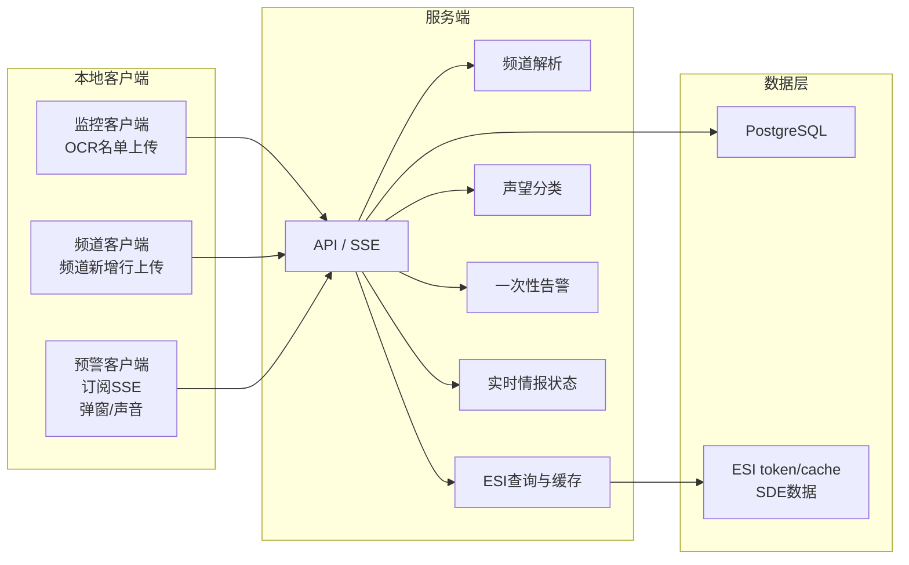
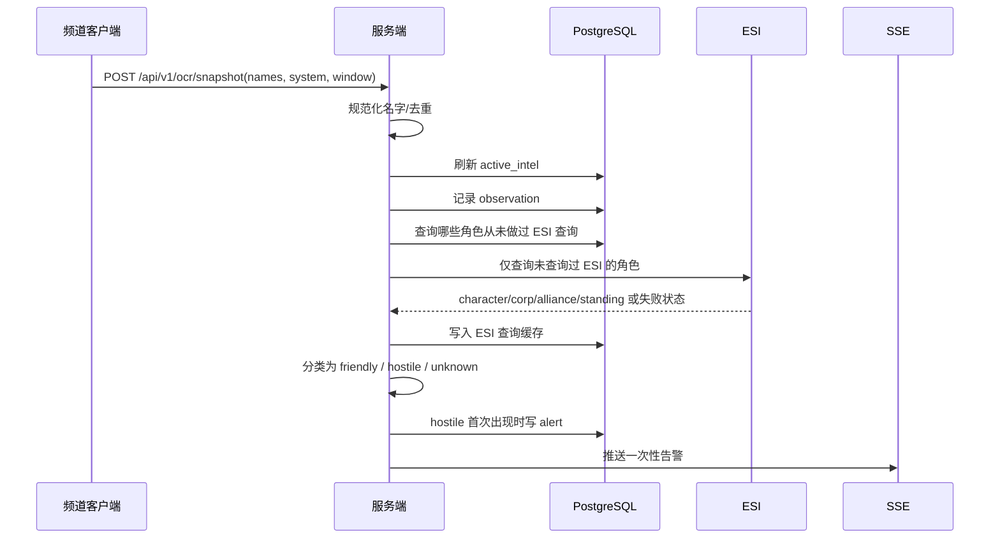
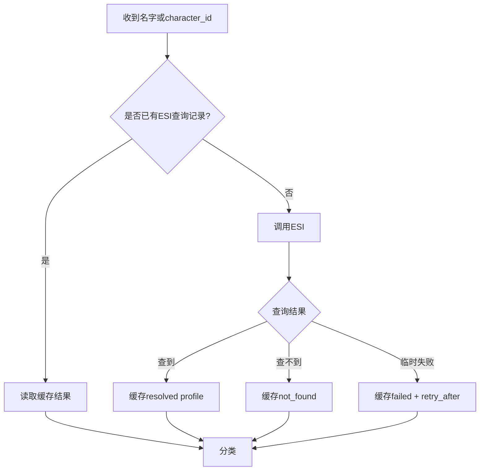
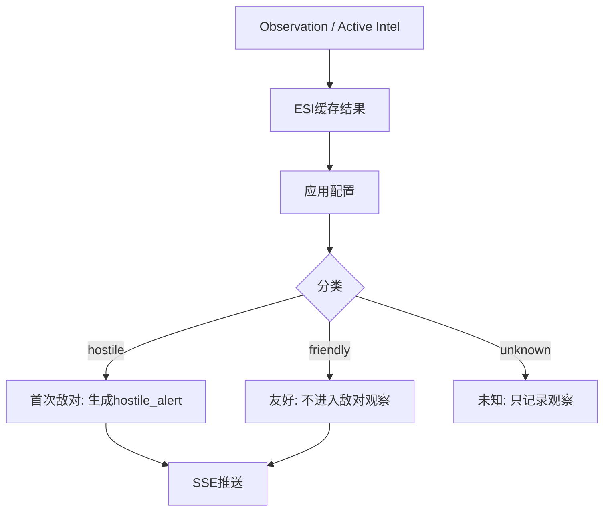
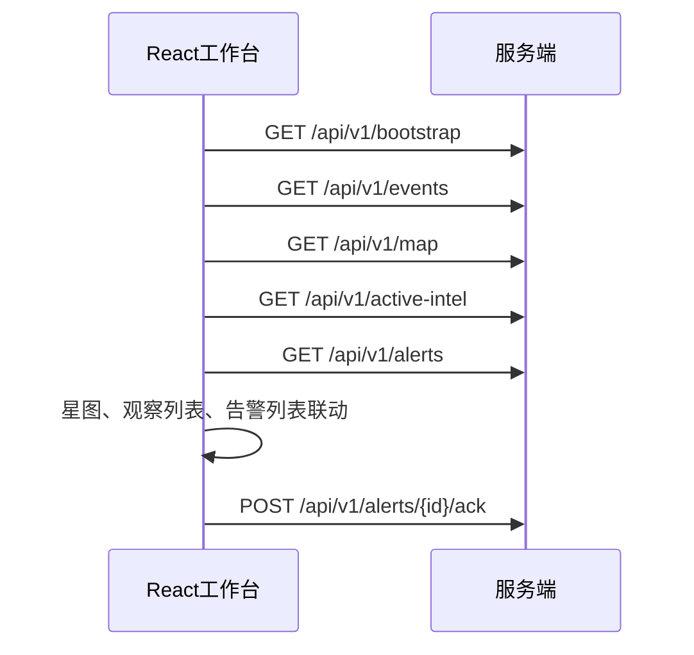
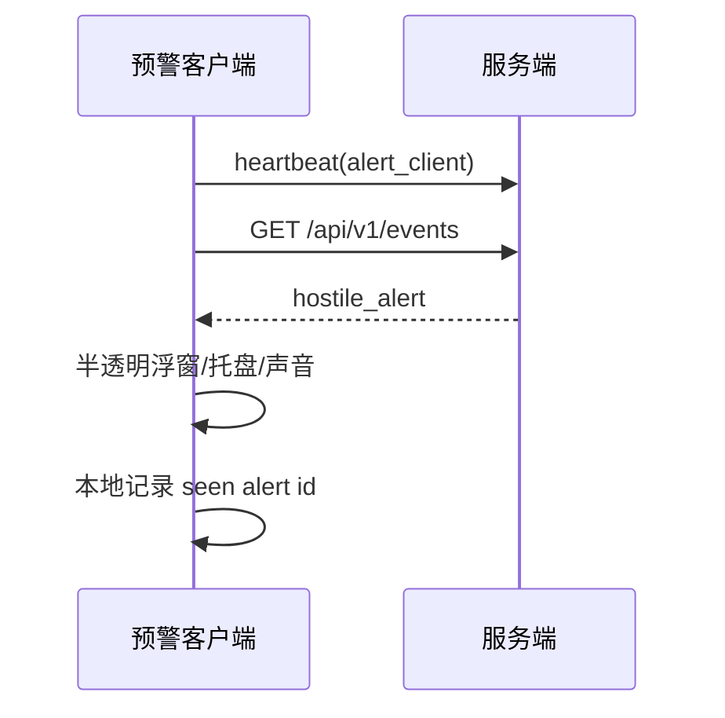

# EVE Sentry 情报工作流

> 日期: 2026-07-09
> 当前准则: 客户端只采集，服务端只分类和触发一次性告警，不再使用威胁评分系统。

## 1. 第一版核心规则

- 监控客户端只上传 OCR 当前名单。
- 预警频道日志由独立频道客户端采集并上报。
- 监控客户端不做 ESI 查询、不做声望过滤、不做敌对判断、不做评分。
- 服务端负责 ESI 查询、缓存、声望分类、告警去重和 SSE 推送。
- ESI 查询触发条件是“这个角色从未查询过 ESI”，不是“本次名单新增”。
- 已查询过 ESI 的角色直接使用缓存结果；缓存可以包含 `resolved`、`not_found`、`failed` 和 `retry_after` 状态。
- 当前实现已缓存 `resolved` 和 `not_found`；`failed` / `retry_after` 是下一阶段缓存治理范围。
- 第一版去掉评分系统。告警不再依赖 `score`、权重、等级计算或 zKill evidence。
- 只要角色被识别为敌对，就触发一次告警。
- 敌对统一指“可能产生攻击行为的人员”，包含中立声望、不良声望和糟糕声望。
- 优秀声望、良好声望归为友好，不进入敌对实时观察和告警。
- 同一个角色同一个分类只告警一次；分类变化时可以再次告警。

## 2. 总体数据流



## 3. OCR 名单工作流



OCR 只表示“当前本地可见”。服务端可以用它更新实时状态，但不能因为 OCR 本身生成敌对告警；只有 ESI 声望或配置规则确认敌对后才告警。

## 4. 预警频道工作流


频道解析规则:

- 没有选择频道时，频道客户端不上报频道日志。
- 客户端只读取新增行，不上传历史文件全量内容。
- `stoneyflap: 8-4GQM Hector Audeles` 中 `stoneyflap` 是 sender，不是威胁目标。
- `clr`、`clear`、`安全了` 等清除词进入 active intel 清除流程，不直接制造告警。

## 5. ESI 查询缓存工作流



缓存含义:

- `resolved`: 已解析到 character_id，并补齐 corporation_id、alliance_id、standing 等资料。
- `not_found`: ESI 明确查不到，短期内不要反复查。
- `failed`: 网络、限速、授权或 ESI 异常，按 `retry_after` 再尝试。

## 6. 分类与告警工作流



分类输入:

- 角色、军团、联盟的 ESI 公开资料。
- authenticated ESI contacts/standings。
- 配置的友好/敌对军团 ID。
- 配置的友好/敌对联盟 ID。
- 旧版手工名单字段仅作兼容，不作为主流程术语。

分类输出:

- `classification`: 兼容字段仍可能返回 `red` / `white`；业务展示应映射为 `hostile` / `friendly`。
- `reason`: 命中的规则，例如 `hostile_standing`、`hostile_alliance`、`friendly_corporation`。
- `alert_required`: 只有敌对首次出现时为 `true`。

声望映射:

- 优秀声望、良好声望: 友好。
- 中立声望、不良声望、糟糕声望: 敌对。
- 未查询到声望或 ESI 查询失败: 未知，只记录观察。

告警去重建议:

```text
alert_key = character_id + classification
```

同一个角色从未知变成敌对，或从友好变成敌对，可以生成新的状态变化告警。

## 7. 前端工作流



前端展示规则:

- 星图节点展示 `敌:x 损:x`，不展示威胁评分。
- 观察列表展示飞行员、星系、来源、分类、命中原因和最近出现时间。
- 告警列表展示敌对出现和分类变化。
- 没有真实来源的数据不显示，尤其不要构造 killmail、ISK 损失或评分。

## 8. 预警客户端工作流



预警客户端不做 ESI、不做分类、不做声望判断，不 ack 服务端告警，只消费服务端告警结果。

## 9. 设计影响

- `ScoringEngine` 应下线或被 `ClassificationEngine` 替代。
- `ThreatEvent.score` / `level` 可以保留为兼容字段，但第一版新逻辑不再依赖它们。
- 配置页面应从“评分配置”改成“分类配置”。
- API filter 中的 `min_score` / `min_level` 属于旧兼容参数，新的主筛选应使用 `classification`、`reason`、`acknowledged` 和时间范围。
- 数据库应保存 ESI 查询状态，避免同一角色在每次 OCR/频道上报时重复查询。
