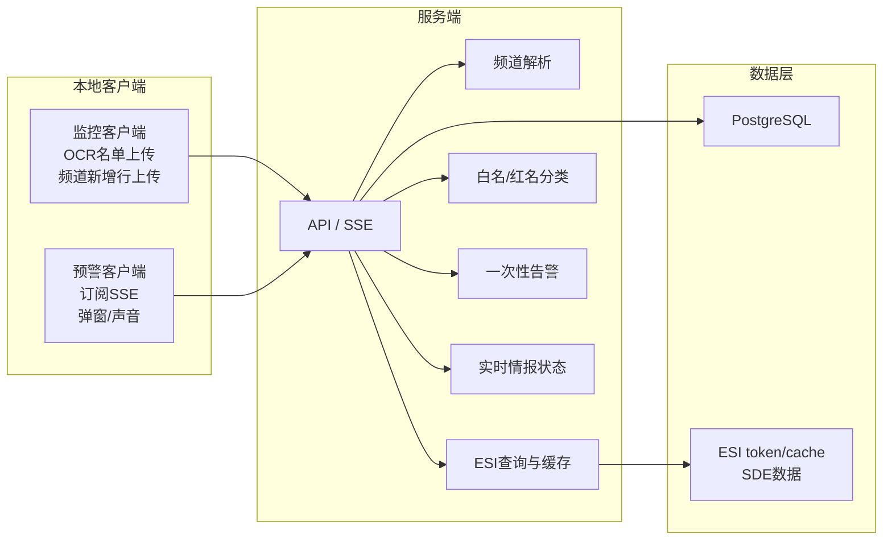
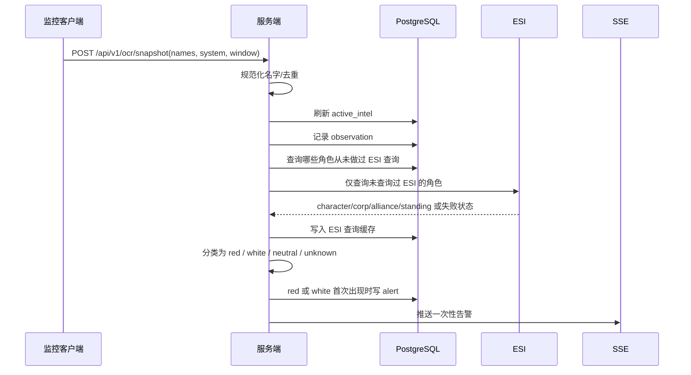
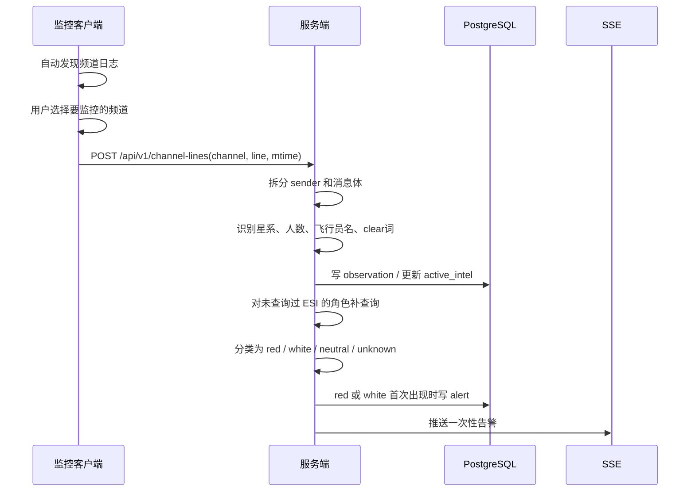
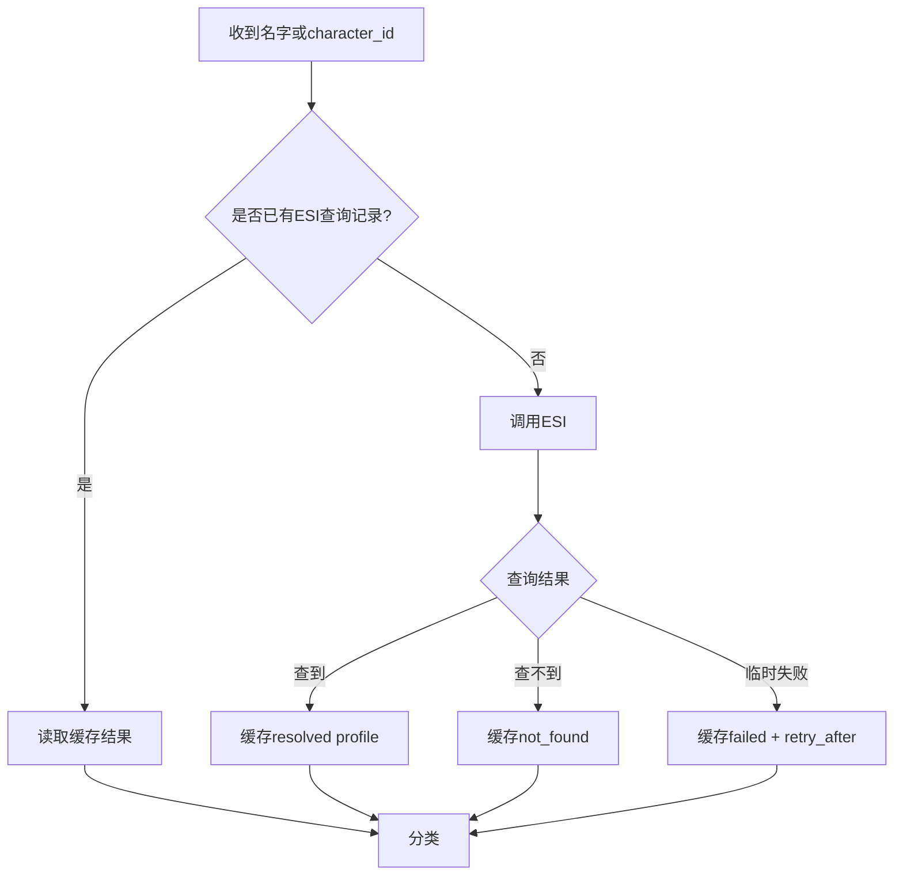
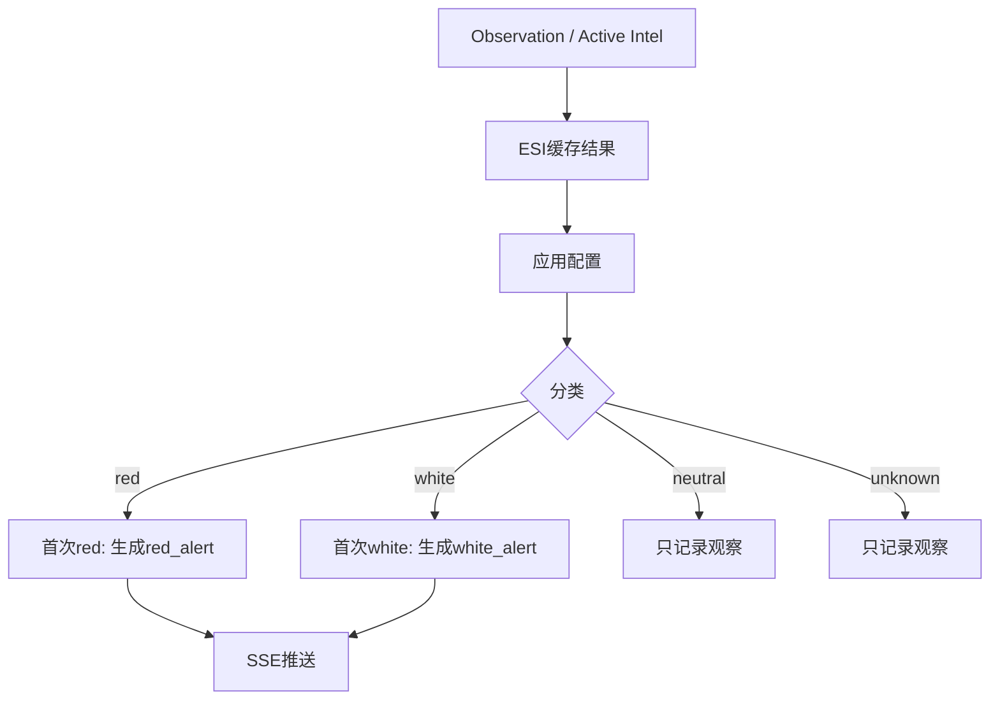
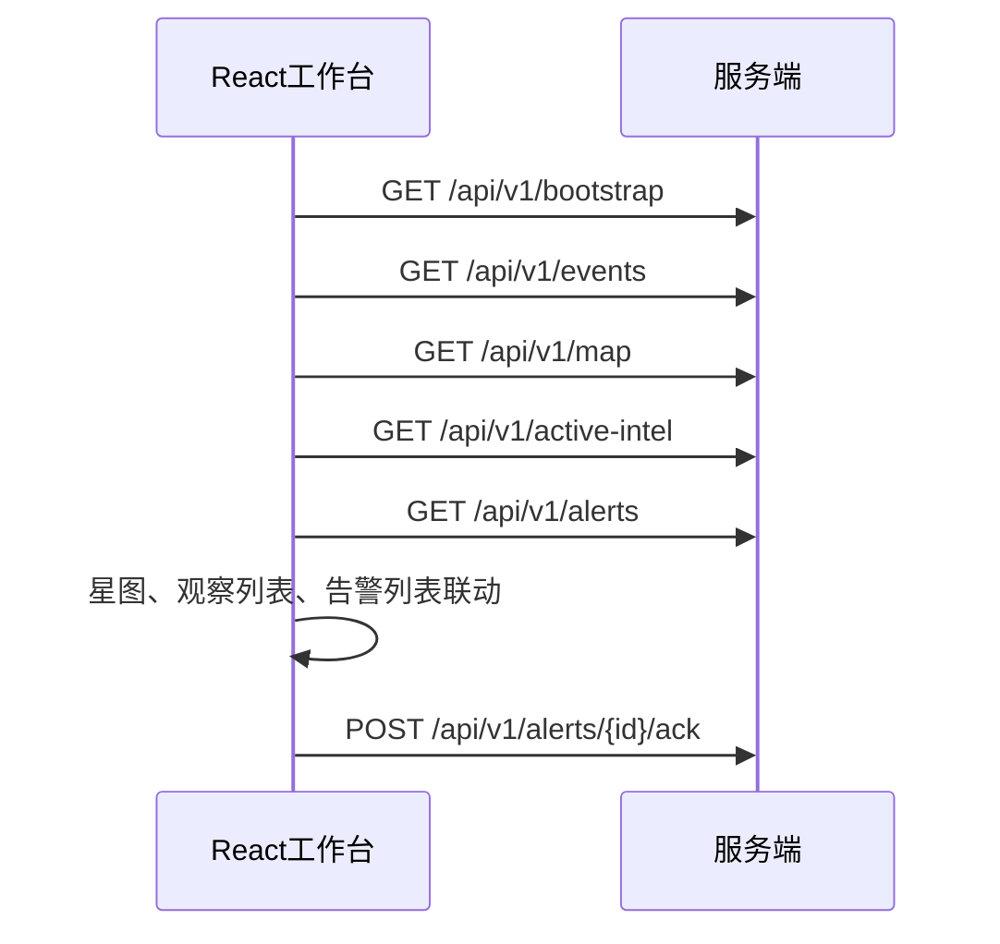
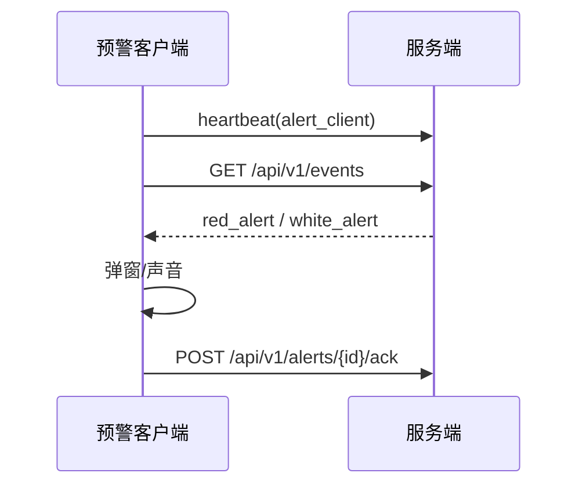

# EVE Sentry 情报工作流

> 日期: 2026-07-09
> 当前准则: 客户端只采集，服务端只分类和触发一次性告警，不再使用威胁评分系统。

## 1. 第一版核心规则

- 监控客户端只上传 OCR 当前名单和用户已选择频道的新增日志行。
- 监控客户端不做 ESI 查询、不做白名单过滤、不做红名判断、不做评分。
- 服务端负责 ESI 查询、缓存、白名/红名分类、告警去重和 SSE 推送。
- ESI 查询触发条件是“这个角色从未查询过 ESI”，不是“本次名单新增”。
- 已查询过 ESI 的角色直接使用缓存结果；缓存可以包含 `resolved`、`not_found`、`failed` 和 `retry_after` 状态。
- 第一版去掉评分系统。告警不再依赖 `score`、权重、等级计算或 zKill evidence。
- 只要角色被识别为白名或红名，就触发一次告警。
- 同一个角色同一个分类只告警一次；分类变化时可以再次告警。

## 2. 总体数据流



## 3. OCR 名单工作流



OCR 只表示“当前本地可见”。服务端可以用它更新实时状态，但不能因为 OCR 本身生成红名告警。

## 4. 预警频道工作流



频道解析规则:

- 没有选择频道时，客户端不上报频道日志。
- 客户端只读取新增行，不上传历史文件全量内容。
- `stoneyflap: 8-4GQM Hector Audeles` 中 `stoneyflap` 是 sender，不是威胁目标。
- `clr`、`clear`、`安全了` 等清除词进入 active intel 清除流程，不直接制造告警。

## 5. ESI 查询缓存工作流



缓存含义:

- `resolved`: 已解析到 character_id，并补齐 corporation_id、alliance_id、standing 等资料。
- `not_found`: ESI 明确查不到，短期内不要反复查。
- `failed`: 网络、限速、授权或 ESI 异常，按 `retry_after` 再尝试。

## 6. 分类与告警工作流



分类输入:

- 手工白名单和红名单。
- 友军/敌对军团 ID。
- 友军/敌对联盟 ID。
- authenticated ESI contacts/standings。
- ESI 角色公开资料。

分类输出:

- `classification`: `red`、`white`、`neutral`、`unknown`。
- `reason`: 命中的规则，例如 `hostile_alliance`、`friendly_corporation`、`standing_white`。
- `alert_required`: 只有 `red` 或 `white` 首次出现时为 `true`。

告警去重建议:

```text
alert_key = character_id + classification
```

同一个角色从 `red` 变成 `white`，或从 `white` 变成 `red`，可以生成新的状态变化告警。

## 7. 前端工作流



前端展示规则:

- 星图节点展示 `红:x 白:y`，不展示威胁评分。
- 观察列表展示飞行员、星系、来源、分类、命中原因和最近出现时间。
- 告警列表展示红名出现、白名出现和分类变化。
- 没有真实来源的数据不显示，尤其不要构造 killmail、ISK 损失或评分。

## 8. 预警客户端工作流



预警客户端不做 ESI、不做分类、不做白名单/红名单判断，只消费服务端告警结果。

## 9. 设计影响

- `ScoringEngine` 应下线或被 `ClassificationEngine` 替代。
- `ThreatEvent.score` / `level` 可以保留为兼容字段，但第一版新逻辑不再依赖它们。
- 配置页面应从“评分配置”改成“分类配置”。
- API filter 中的 `min_score` / `min_level` 属于旧兼容参数，新的主筛选应使用 `classification`、`reason`、`acknowledged` 和时间范围。
- 数据库应保存 ESI 查询状态，避免同一角色在每次 OCR/频道上报时重复查询。
